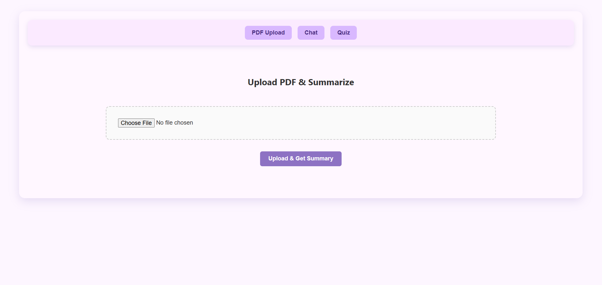
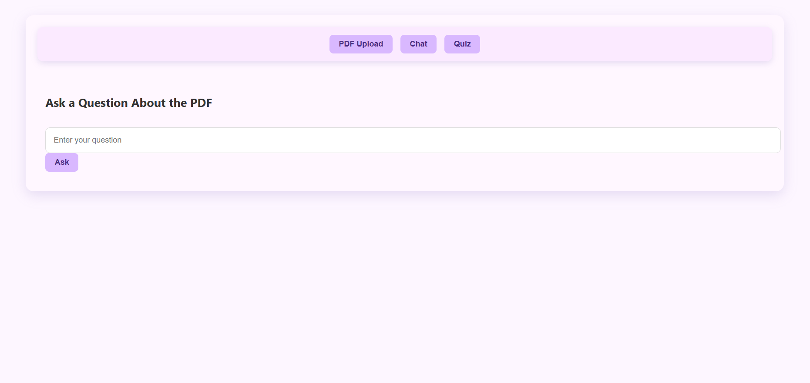
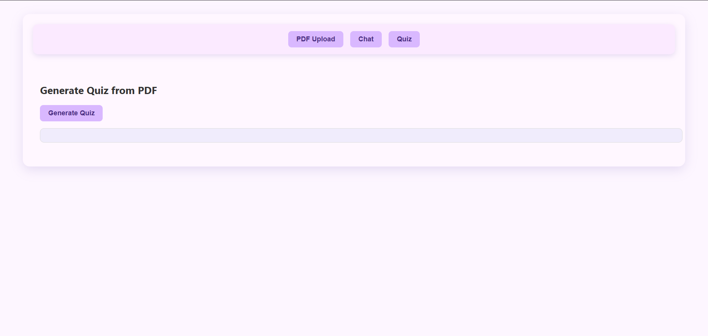

# 📄 KnowTera

**KnowTera** is a smart, pastel-themed web application powered by **React** and **Groq** that allows users to upload PDF files, generate summaries, chat with an AI about the content, and create quizzes — all in one seamless interface. Built with care for user experience and powered by LLM intelligence.

---

## 🚀 Live Website

## 🔗 [View Live](https://knowtera.vercel.app/)

## 📸 Screenshots

| Upload PDF                          | Chat with PDF                   | Quiz Generator                  |
| ----------------------------------- | ------------------------------- | ------------------------------- |
|  |  |  |

---

## ✨ Features

- 📤 Upload and parse PDF documents
- 🧠 AI-generated **summaries**
- 💬 Chat about your PDF using natural questions
- ❓ Generate quizzes directly from uploaded content
- 🎨 Elegant, pastel UI with modern UX
- ⚡ Fast and responsive performance

---

## 🧱 Tech Stack

| Category       | Stack                            |
| -------------- | -------------------------------- |
| **Frontend**   | React, Tailwind CSS, JSX         |
| **Backend**    | Express.js, PyPDF2 (for parsing) |
| **AI Engine**  | Groq LLM                         |
| **Deployment** | Vercel                           |

---

## 💻 Installation & Setup

## Clone the repo
git clone https://github.com/Akshita3104/Knowtera
cd client

## Install frontend dependencies
npm install

## Start the React frontend
npm start

## Start your backend
cd server
npm install
node server.js
